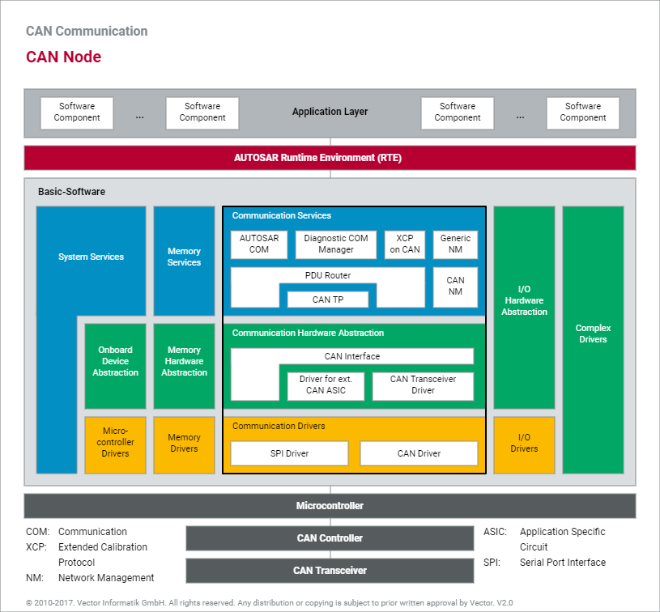
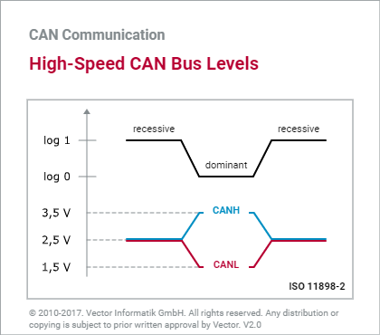
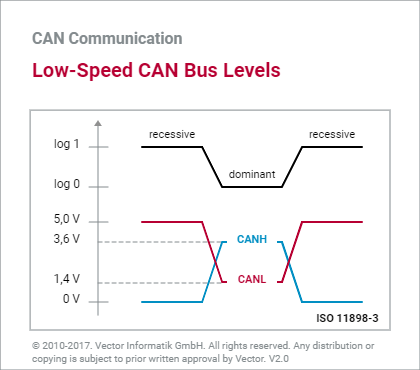
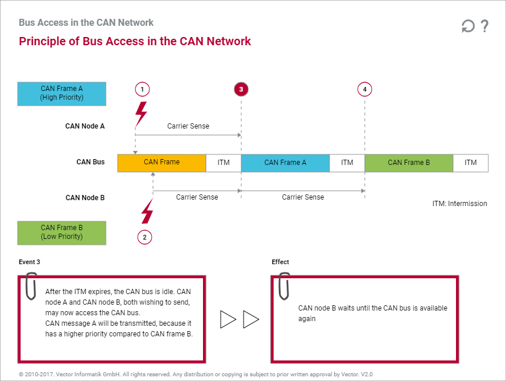
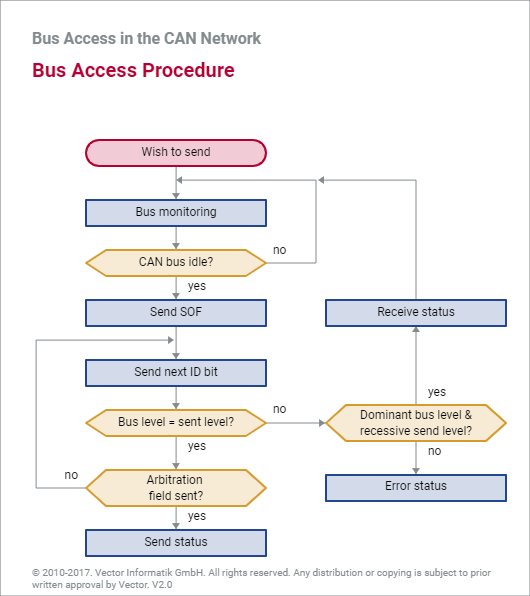
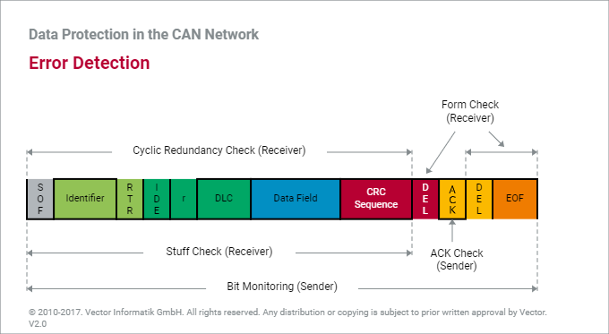
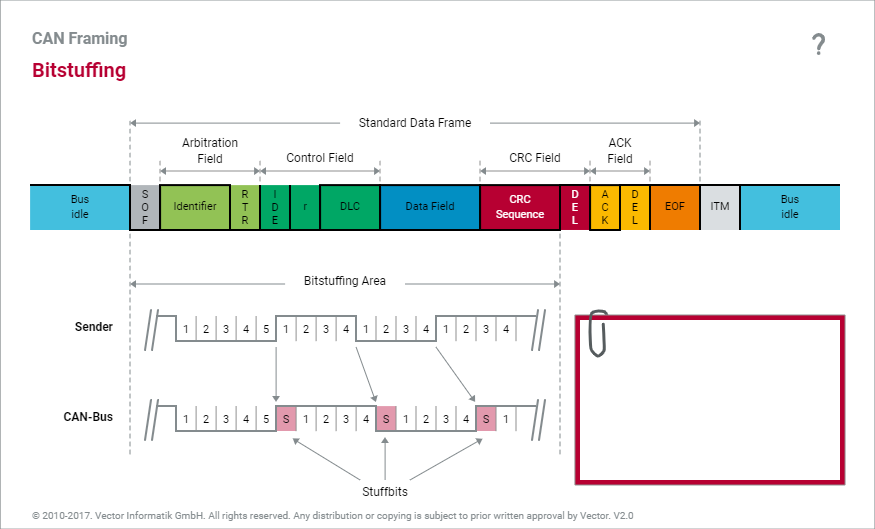

# CAN (Contoller Area Network)

CAN은 P2P network이다. 즉, 개별 node가 CAN bus에서 data를 읽거나 쓰기 위해 access할 때 control하는 master가 없다.

CAN의 node가 data 전송 준비가 완료되면, bus의 준비 여부를 확인하고 CAN frame을 network에 작성한다. CAN frame은 node의 주소가 없고, 고유한 arbitration ID로 frame이 분류된다.

다중 node가 동시에 message를 CAN bus로 전송하려는 경우 최우선 순위를 가진 node (가장 낮은 arbitration ID)가 자동적으로 bus에 access 된다.

ISO 규격에 따라 2 가지로 구분되며 통신 속도에 차이가 있다.
* ISO 11898 : 1Mbps 이상의 고속 통신 가능
* ISO 11519 : 129Kbps 까지의 통신 가능

## CAN Communication

### Bus Level

 

### CSMA/CA (Carrier Sense Multiple Access with Collision Avoidance)

### Bus Access Procedure

### Error Detection

## Bit Stuffing

CAN은 동기 통신을 하므로 같은 level의 신호를 5개 이상 연속적으로 전송할 경우, 동기를 맞출 목적으로 alternative level로 stuff bit를 추가하여 전송한다.

Falling edge마다 재 동기화를 한다.

## 호환성

대부분의 CAN v2.0A controller는 표준 CAN format의 message만 Tx/Rx가 가능하며, CAN v2.0B의 message는 식별을 하여 무시한다. 이를 v2.0B Passive라고 한다. CAN v2.0A만 송수신 가능한 controller의 경우 v2.0B message는 error를 발생시킨다.

CAN v2.0B controller는 양쪽 모두 송수신이 가능하다.
