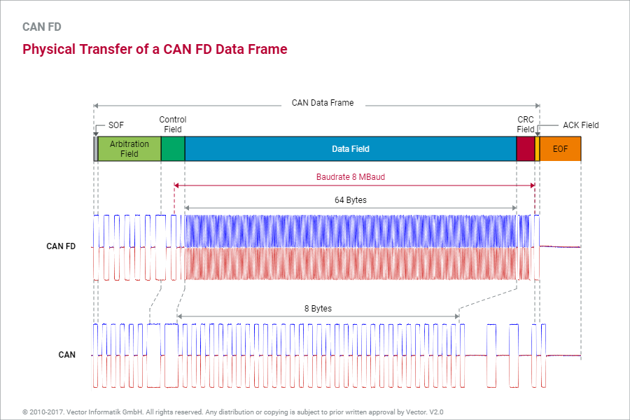

# CAN FD (CAN with Flexible Data rate)

주요 변경점은 다음과 같다.
* Higher Bit Rate: Data 전송 속도가 빨라졌다.
* Extended Payload: Data length가 8 -> 64로 변경 되었다.

CAN FD message 하나에 다수의 PDU가 포함되기 때문에, 수신기는 data 식별용 CAN ID를 사용할 수 없다.

CAN FD message 전송은 다음과 같은 event를 통하여 실행된다.
* Message의 발신 buffer가 가득 찬 경우.
* 완성 message에 대해 정의된 timeout이 만료된 경우.
* 각 PDU에 대해 정의한 timeout이 만료된 후에는 PDU가 포함된 message가 발송.
* PDU가 발신용 buffer에 복사된 후 즉시 message를 발신할 수 있는 속성을 가진 경우.

## Bit Stuffing

CAN의 경우 bit stuffing 적용 영역이 SOF ~ CRC 였는데, CAN FD의 경우 SOF ~ Data Field로 변경되었다.
