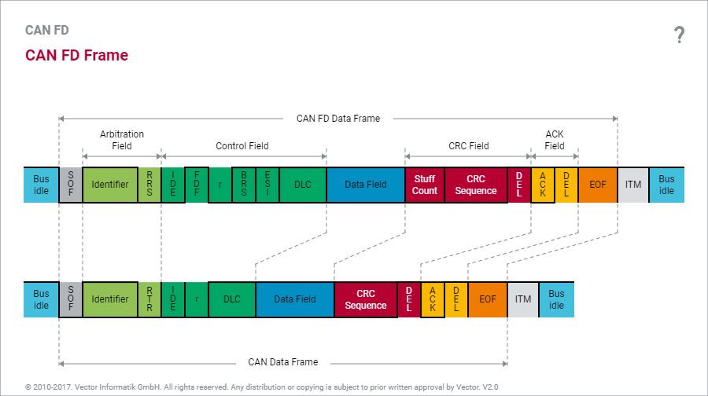

# CAN FD Frame



```
|  1  |              11               |  1  |  1  |  1  |  1  |  1  |  1  |  4  |   0...64   |     4      | 17...21  |  1  |  1  |  1  |  7  |  3  |
      |    11   |  1  |  1  |   18    |  1  |  0  |
+-----+-------------------------------------+-----------------------------------+------------+-----------------------------+-----+-----+-----+-----+
| SOF | Arbitration Field                   | Control Field                     | Data Field | CRC Field                   | ACK Field | EOF | ITM |
+-----+-------------------------------------+-----------------------------------+------------+-----------------------------+-----+-----+-----+-----+
      | ID                            | RRS | IDE | FDF | r   | BRS | ESI | DLC |            | Stuff Cnt. | CRC Seq. | DEL | ACK | DEL |
      | Base ID | SRR | IDE | Ext. ID | RRS |     | FDF | r   | BRS | ESI | DLC |
```

* SOF [1 bit]
	+ Start of Frame
	+ Logic 0
* RRS [1 bit]
	+ Remote Request Substitution
	+ CAN FD에서는 remote frame이 제거 되었다.
	* Level 0
* SRR
	+ Substitute Remote Request
* IDE [1 bit]
	+ Identifier Extention
	+ 표준(bit 0)과 확장(bit 1)을 구분한다.
* FDF [1 bit]
	+ Flexible Data Rate Format
	+ Logic 0: Classical CAN
	+ Logic 1: CAN FD
* r [1 or 2 bits]
	+ Reserved bit이다.
	+ Logic 0
* BRS [1 bit]
	+ Bit Rate Switch
	+ 0: No change of bit rate for data phase
	+ 1: Change to higher bit rate for data phase
* ESI [1 bit]
	+ Error State Indicator
* DLC [4 bits]
	+ Data Length Code
	+ Data field의 byte 수를 나타낸다.

  > DLC | CAN | CAN FD
  > :--:|:---:|:-----:
  > 0   | 0   | 0
  > 1   | 1   | 1
  > ... | ... | ...
  > 8   | 8   | 8
  > 9   | 8   | 12
  > 10  | 8   | 16
  > 11  | 8   | 20
  > 12  | 8   | 24
  > 13  | 8   | 32
  > 14  | 8   | 48
  > 15  | 8   | 64

* Data Bytes [0...64 bits]
* CRC Field [16 bits]
	+ Cyclic Redundancy Check
	+ Stuff Count [4 bits]
		- Modulo 7 연산을 하여 값을 구한다.
		- 3 bits + Parity bit
	+ CRC Sequence [17...21 bits]
		- 17 bits with 0~16 bytes data field
		- 21 bits with 17~64 bytes data field
	+ 1 bit recessive delimiter
* ACK Field [2 bits]
	+ ACKnowledgement
	+ 1 bit ACK slot + 1 bit recessive delimiter
	+ Message를 정확하게 수신한 모든 CAN controller는 message의 끝에 ACK bit를 전송한다.
	+ Transmission node는 bus 상에 ACK bit를 확인하고, ACK가 발견되지 않을 경우 전송을 재시도한다.
	+ 임의의 node에서 올바른 message를 수신하면 ACK field를 받는 순간 ACK slot의 값을 0으로 설정해 bus 상에서 계속 전송하게 한다.
* EOF [7 bits]
	+ End of Frame
	+ Logic 1
* ITM [3 bits]
	+ Intermission Frame Space
	+ Logic 1
	+ 연속적인 message들을 구분하기 위해 존재한다.
