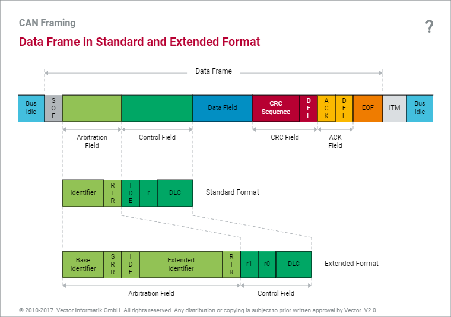
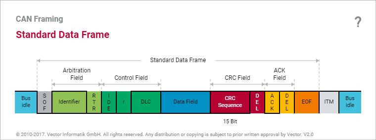
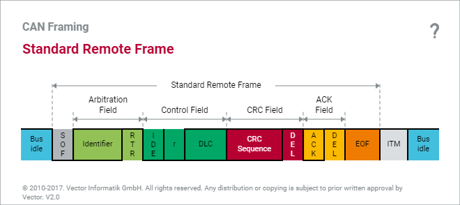
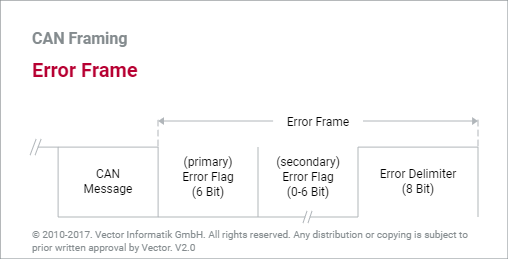

# CAN Frame



```
|  1  |              11               |  1  |  1  | 1  |  4  |   0...8    |    15    |  1  |  1  |  1  |  7  |  3  |
      |    11   |     |     |   18    |  1  |
+-----+-------------------------------------+----------------+------------+----------------+-----------+-----+-----+
| SOF | Arbitration Field                   | Control Field  | Data Field | CRC Field      | ACK Field | EOF | ITM |
+-----+-------------------------------------+----------------+------------+----------------+-----------+-----+-----+
      | ID                            | RTR | IDE | r  | DLC |            | CRC Seq. | DEL | ACK | DEL |
      | Base ID | SRR | IDE | Ext. ID | RTR | r1  | r0 | DLC |
```

* SOF [1 bit]
	+ Start of Frame
	+ Logic 0
* Arbitration ID [11 or 29 bits]
	+ Message를 식별하고 message의 우선순위를 지정한다. 표준과 확장 data frame이 닽은 base ID를 가지면 표준 data frame이 우선 순위를 갖는다.
	+ 표준 CAN (v2.0A) : 11 bits
	+ 확장 CAN (v2.0B) : 29 bits
* RTR [1 bit]
	+ Remote Transmission Request
	+ Remote frame(bit 1)과 data frame(bit 0)을 구별하는 역할을 한다.
	+ Remote frame의 경우 data field를 가지지 않는다. 즉 DLC가 0이다.
* SRR
	+ Substitute Remote Request
	+ Logic 1
* IDE [1 bit]
	+ Identifier Extention
	+ 표준(bit 0)과 확장(bit 1)을 구분한다.
* r [1 or 2 bits]
	+ Reserved bit이다.
	+ Logic 0
	+ CAN v2.0B는 r0, r1을 사용한다.
* DLC [4 bits]
	+ Data Length Code
	+ Data field의 byte 수를 나타낸다.
* Data Bytes [0...8 bits]
* CRC Field [16 bits]
	+ Cyclic Redundancy Check
	+ 15 bits CRC sequence + 1 bit recessive delimiter
* ACK Field [2 bits]
	+ ACKnowledgement
	+ 1 bit ACK slot + 1 bit recessive delimiter
	+ Message를 정확하게 수신한 모든 CAN controller는 message의 끝에 ACK bit를 전송한다.
	+ Transmission node는 bus 상에 ACK bit를 확인하고, ACK가 발견되지 않을 경우 전송을 재시도한다.
	+ 임의의 node에서 올바른 message를 수신하면 ACK field를 받는 순간 ACK slot의 값을 0으로 설정해 bus 상에서 계속 전송하게 한다.
* EOF [7 bits]
	+ End of Frame
	+ Logic 1
* ITM [3 bits]
	+ Intermission Frame Space
	+ Logic 1
	+ 연속적인 message들을 구분하기 위해 존재한다.

## Data Frame

Data 전송에 사용된다.



## Remote Frame

수신할 node에서 원하는 message를 전송할 수 있는 송신 node에게 전송을 요청할 때 사용된다.



## Error Frame

Message의 error가 감지되었을 때 system에 알릴 목적으로 사용된다.



## Overload Frame

Message의 동기화를 목적으로 사용된다.
