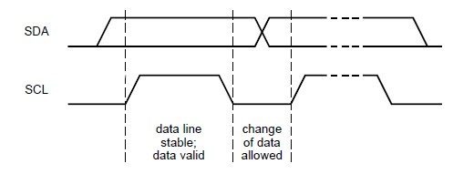
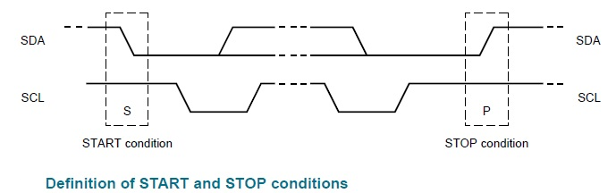
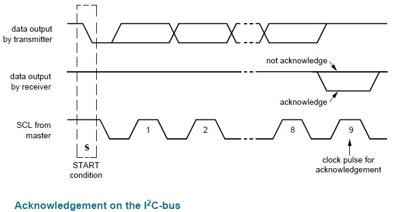
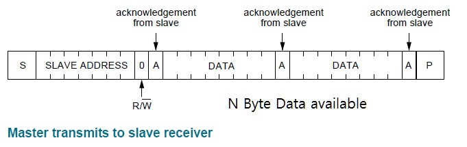
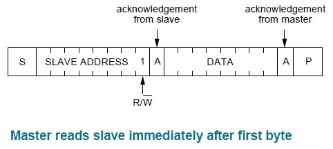

# I2C (Inter Integrated Circuit)

I2C는 Inter Integrated Circuit의 약자로 TWI(Two Wire Interface)라고도 불린다.

`SCL`, `SDA` 두 선으로 통신이 가능하다.

Master / Slave 구조로 통신을 한다.

대기 상태일 때는 SCL, SDA 모두 high상태이다.
Master가 통신을 시작하면, 먼저 SDA가 low로 변하고 이를 인지하고 SCL이 clock 역할을 한다.
Master가 통신을 종료하면, SCL이 high로 되고, SDA도 뒤이어 high로 된다.

Slave들은 각각 고유의 7bit 주소를 갖고 있다.

Master가 통신하기를 원하는 Slave의 주소를 보낸다.

Master가 1bit R/S를 보낸다.
* R(1bit high) : Read
* S(1bit low) : Write

Slave는 Ack를 보낸다. (ACK = 1bit low)

R/S에 따라 8bit씩 데이터를 보내고, 매번 Ack를 보낸다.

## Bit 전송

`SCL` clock 1pulse마다 data 1bit가 전송된다.

## Start, Stop

* I2C Bus not busy : `SDA`, `SCL` 모두 high 상태로 유지된다.
* Start: `SCL`이 high인 상태에서 `SDA`가 H->L로 변화하는 시점.
* Stop: `SCL`이 high인 상태에서 `SDA`가 L->H로 변화하는 시점.

## Addressing

I2C bus의 start 이후 첫 byte는 항상 `slave address 7bit + Read/Write 1bit`로 구성된다.

## Acknowledge

Slave receiver는 1byte 수신 시마다 ack를 발생시켜야 한다.

Master receiver 역시 1byte 수신 시마다 ack를 발생시켜야 한다.

Ack란 `SCL`의 ack clock에서 `SDA`를 L상태로 하는 것이다. `SDA`가 H상태인 것이 no ack이다.

## Communication

