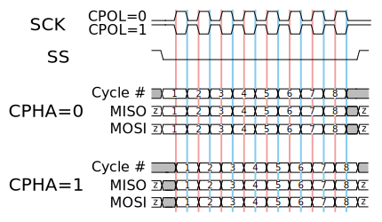

# SPI (Serial Peripheral Interface)

SPI는 synchronous serial communication interface specification이다.

SPI device들은 full duplex모드로 통신하며, single master의 master / slave 구조를 갖는다. Multiple slave device들은 개별적인 SS(slave select)를 통하여 동작한다.

## Interface

* SCLK: Serial Clock from master
* MOSI: Mastter Output Slave Input
* MISO: Master Input Slave Output
* SS: Slave Select

## Operation

* CPOL: Clock Polarity
* CPHA: Clock Phase

### Mode Number

SPI mode | Clock Polarity (CPOL/CKP) | Clock Phase (CPHA) | Clock Edge (CKE/NCPHA)
:-------:|:-------------------------:|:------------------:|:---------------------:
0        | 0                         | 0                  | 1
1        | 0                         | 1                  | 0
2        | 1                         | 0                  | 1
3        | 1                         | 1                  | 0

### SPI Bus

#### Typical SPI Bus

### Daisy-Chained SPI Bus

